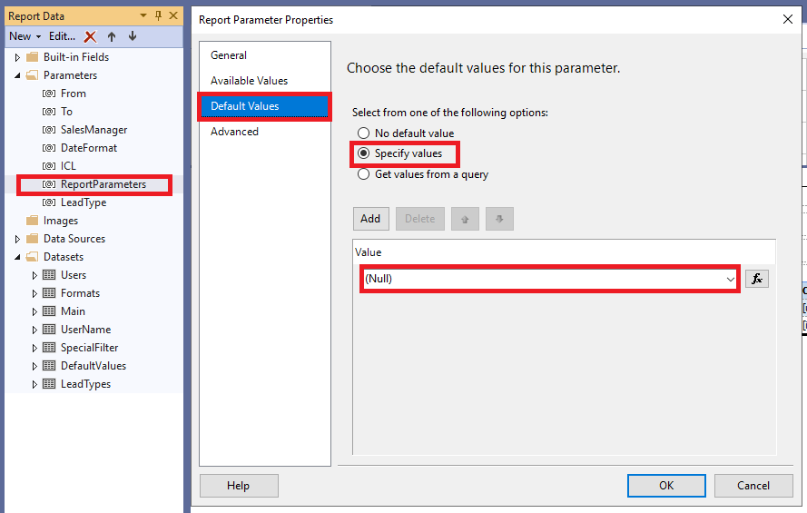

# Reports
Users can create custom reports in Visual Studio using data from [eWay-CRM](https://www.eway-crm.com).

For deeper understanding of report building process google keywords "SQL Server Reporting Services".

## Development environment

### Visual studio
If Visual Studio 2019 is already installed, you can edit the list of workloads in Visual Studio Installer to include SSDT. If you don’t have [Visual Studio 2019](https://visualstudio.microsoft.com/) installed, then download and install Visual Studio 2019 Community.

In Visual Studio Installer for SQL Database projects, select SQL Server Data Tools under Data storage and processing in the list of workloads.

Install [addon](https://marketplace.visualstudio.com/items?itemName=ProBITools.MicrosoftReportProjectsforVisualStudio) to be able to edit *.rptproj files.

### Edit report
Create new file or open existing .rdl file. All examples are from Visual Studio 2019 development environment.

### Data Sources
Reports use data from local eWay-CRM database. Default server instance is (localdb)\EWAYSQL.

### Datasets
Create a Dataset to obtain data from Data Source.

### Parameters
There is one mandatory parameter **"ReportParameters"** which needs to be created in each report. This parameter is used to display selected reports parameters to the user - replaced by eWay-CRM at runtime, **not in Visual Studio designer preview**.

Other potential parameters can be created manually or automatically by design tool when used in dataset query.

Currently it is not possible to chain parameters even if desing tool is able do that. In other words no parameter can depend on the value of other parameter.

### Layout
There is a wide range of object which can be used to display the data. Object are availabe from right-click context menu. Most frequently used are Tablix, Tables or Charts.

### Deployment
Created report is deployed to the eWay-CRM via [Administration Application](https://kb.eway-crm.com/documentation/5-administration-application/administration-application-older-version-of-administration-environment/5-9-reports/list-and-management-of-reports).